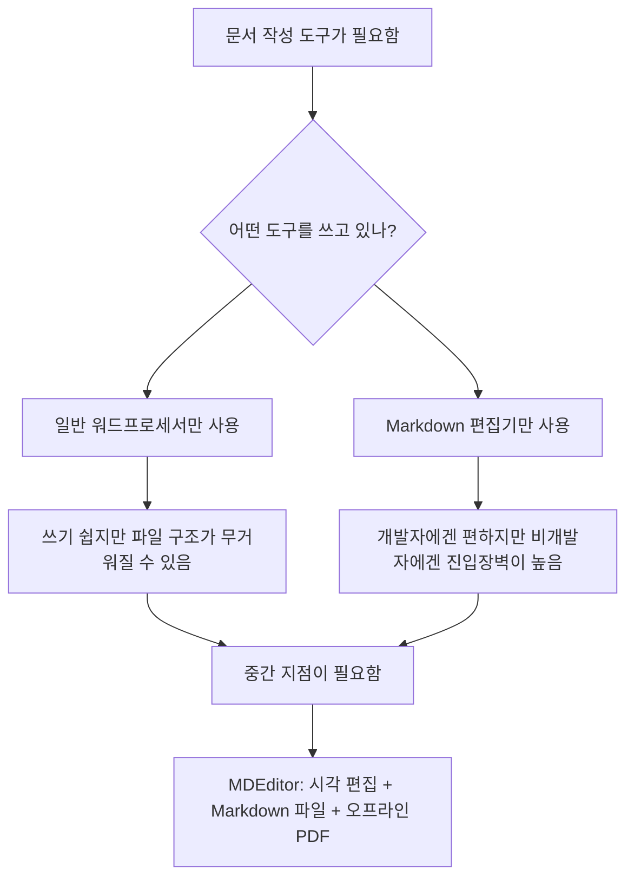
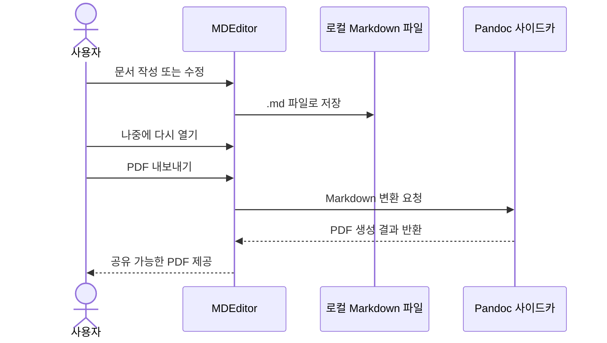

# MDEditor

MDEditor는 Windows 환경에서 문서를 쉽게 작성할 수 있도록 만든 오프라인 문서 편집기입니다. Markdown의 장점은 유지하면서도, 사용자는 일반 문서 편집기처럼 화면을 보며 시각적으로 글을 작성할 수 있게 하는 것이 이 프로젝트의 핵심입니다.

## 다운로드

- 저장소: [sinmb79/MD-Editer](https://github.com/sinmb79/MD-Editer)
- 최신 릴리스: [MDEditor v0.1.0](https://github.com/sinmb79/MD-Editer/releases/tag/v0.1.0)
- Windows 설치 파일: [MDEditor_0.1.0_x64-setup.exe](https://github.com/sinmb79/MD-Editer/releases/download/v0.1.0/MDEditor_0.1.0_x64-setup.exe)

## 개발 취지

문서를 작성하는 사람 모두가 Markdown 문법에 익숙한 것은 아닙니다. 하지만 Markdown 파일은 가볍고 관리가 쉬우며, 다른 시스템으로 옮기기에도 유리합니다.

MDEditor는 이 사이의 간극을 줄이기 위해 만들어졌습니다.

- 사용자는 문법 대신 화면을 보며 글을 씁니다.
- 문서는 여전히 단순한 `.md` 파일로 저장됩니다.
- 인터넷이 없어도 로컬에서 작업할 수 있습니다.
- 완성된 문서는 PDF로 손쉽게 내보낼 수 있습니다.

## 목적

이 프로젝트의 목적은 범용 협업 플랫폼을 만드는 것이 아닙니다.

대신 아래와 같은 상황을 더 쉽고 가볍게 만드는 데 초점을 두고 있습니다.

- 비개발자도 바로 이해할 수 있는 한글 문서 작성 환경
- 로컬 파일 기반의 단순한 문서 관리
- 자주 쓰는 문서를 빠르게 시작할 수 있는 템플릿
- 초안 작성부터 PDF 배포까지 이어지는 간단한 흐름

## 개념도


## 어떤 문제를 해결하나



## 작동 방식



## 주요 기능

- 한글 중심의 데스크톱 UI
- TOAST UI Editor 기반 WYSIWYG 편집
- `새 문서 / 열기 / 저장 / 다른 이름으로 저장` 흐름
- 빈 문서, 보고서, 회의록, 기안서 템플릿 제공
- Pandoc 기반 PDF 내보내기
- 오프라인 로컬 파일 작업
- Windows NSIS 설치 파일 생성 지원

## 이런 분께 적합합니다

- 보고서나 내부 문서를 자주 작성하는 사무직 사용자
- Markdown 파일은 쓰고 싶지만 문법은 직접 다루고 싶지 않은 사용자
- 클라우드가 아닌 로컬 파일 중심으로 관리하고 싶은 팀
- 초안 작성 후 PDF로 배포하는 흐름이 필요한 사용자

## 이런 용도에는 맞지 않습니다

- 실시간 공동 편집
- 클라우드 기반 협업 문서 플랫폼
- 복잡한 지면 편집이나 고급 출판 레이아웃 작업

## 저장소 구성

- `src/`: React UI, 에디터 래퍼, 템플릿, 파일 처리 로직
- `src-tauri/`: Tauri 데스크톱 앱, 권한 설정, PDF 내보내기 명령
- `scripts/`: Windows용 Pandoc 동기화 및 Tauri 실행 보조 스크립트
- `docs/`: 사용자 안내 문서

## 일반 사용자용 안내

설치 파일이 릴리스에 올라와 있다면 가장 쉬운 사용 순서는 아래와 같습니다.

1. 저장소의 `Releases` 페이지를 엽니다.
2. Windows 설치 파일을 내려받습니다.
3. MDEditor를 설치합니다.
4. 앱을 실행한 뒤 빈 문서나 템플릿으로 시작합니다.
5. 문서를 저장합니다.
6. 필요할 때 PDF로 내보냅니다.

자세한 사용 설명은 [docs/USER-GUIDE.md](./docs/USER-GUIDE.md)를 참고하면 됩니다.

## 개발자용 안내

### 준비물

- Node.js 20+
- Rust toolchain (`cargo`, `rustc`)
- Visual Studio x64 C++ 도구
- Windows에 설치된 Pandoc

### 설치 및 테스트

```bash
npm install
npm test
npm run build
```

### Windows 데스크톱 빌드

```bash
npm run sync:pandoc
npm run tauri:dev:win
npm run tauri:build:win
```

보조 스크립트는 다음 일을 자동으로 처리합니다.

- Visual Studio 개발 셸 로드
- Cargo 경로 설정
- 설치된 Pandoc를 Tauri sidecar 위치로 복사
- Tauri 데스크톱 개발 또는 빌드 실행

## 현재 상태

Phase 0 기준으로 아래 항목을 로컬에서 확인했습니다.

- 프런트엔드 테스트 통과
- 프로덕션 웹 빌드 통과
- Windows Tauri 빌드 통과
- NSIS 설치 파일 생성 완료

실사용 기준으로 남은 최종 단계는 수동 확인입니다.

1. 설치 파일로 앱 실행
2. 문서 작성
3. `.md` 파일 저장 후 다시 열기
4. PDF 내보내기 결과 확인

## 라이선스

이 프로젝트는 MIT License로 공개되어 있습니다. 자세한 내용은 [LICENSE](./LICENSE)를 참고하세요.
