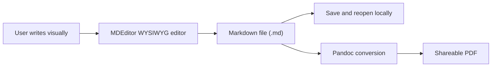
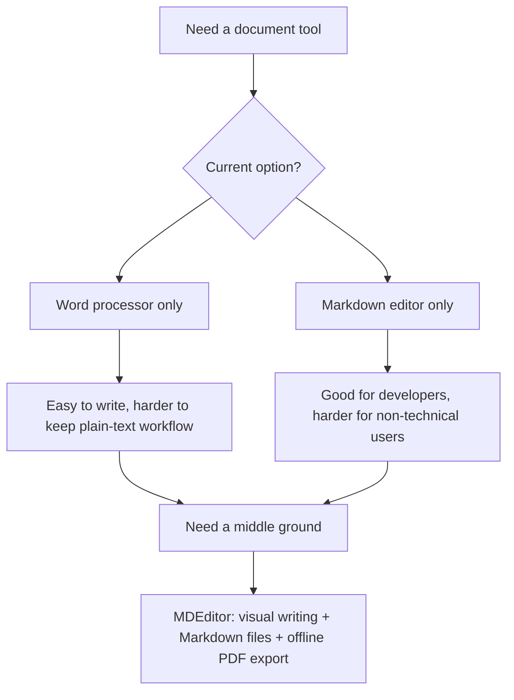
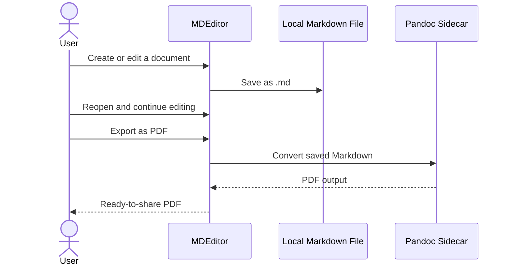

# MDEditor

MDEditor is a Windows-first offline document editor for people who want to write formal documents without dealing with raw Markdown syntax. It combines a Korean WYSIWYG editing experience with simple file handling and PDF export.

## Download

- Repository: [sinmb79/MD-Editer](https://github.com/sinmb79/MD-Editer)
- Latest release: [MDEditor v0.1.0](https://github.com/sinmb79/MD-Editer/releases/tag/v0.1.0)
- Windows installer: [MDEditor_0.1.0_x64-setup.exe](https://github.com/sinmb79/MD-Editer/releases/download/v0.1.0/MDEditor_0.1.0_x64-setup.exe)

## Why This Project Exists

Many teams still want the portability of Markdown files, but the people writing the documents often prefer something that feels closer to a word processor.

This project was created to bridge that gap:

- write in a familiar visual editor
- keep documents as simple `.md` files
- work fully offline
- export polished PDFs when the document is ready

## Project Goal

The goal is not to build a general-purpose publishing platform.

The goal is to make everyday document work easier for non-technical users who need:

- a clear Korean interface
- local file ownership
- a lightweight editing workflow
- repeatable document templates
- a straightforward path from draft to PDF

## Concept At A Glance



## What Problem It Solves



## How The App Works



## Key Features

- Korean-first desktop UI
- WYSIWYG editing with TOAST UI Editor
- Native `New / Open / Save / Save As` workflow
- Built-in templates for blank documents, reports, meeting notes, and proposals
- PDF export through Pandoc
- Offline-first local file workflow
- Windows NSIS installer build

## Who It Is For

- office teams writing reports or proposal drafts
- non-developers who do not want to see Markdown syntax while writing
- teams that want local files instead of cloud-only editing
- users who need a simple path from draft to PDF

## Who It Is Not For

- users looking for real-time collaboration
- teams needing cloud sync or online review flows
- advanced publishing workflows with complex layout design

## Repository Layout

- `src/`: React UI, editor wrapper, templates, and file workflow logic
- `src-tauri/`: Tauri desktop app, Windows bundling config, and PDF export command
- `scripts/`: Windows helper scripts for sidecar sync and Tauri build automation
- `docs/`: simple documentation for non-developers and maintainers

## For Non-Developers

If a GitHub Release is published, the easiest path is:

1. Open the repository's `Releases` page.
2. Download the Windows installer.
3. Install MDEditor.
4. Open the app, choose a template if needed, and start writing.
5. Save the document as a Markdown file.
6. Export a PDF when the document is ready.

For a step-by-step explanation, see [docs/USER-GUIDE.md](./docs/USER-GUIDE.md).

## For Developers

### Requirements

- Node.js 20+
- Rust toolchain with `cargo` and `rustc`
- Visual Studio with the x64 C++ toolchain
- Pandoc installed locally on Windows

### Install And Test

```bash
npm install
npm test
npm run build
```

### Windows Desktop Build

```bash
npm run sync:pandoc
npm run tauri:dev:win
npm run tauri:build:win
```

The helper scripts will:

- load the Visual Studio developer shell
- add Cargo to `PATH`
- sync the installed Pandoc binary into the Tauri sidecar location
- run the local Tauri CLI for desktop development or packaging

## Current Status

Phase 0 is implemented and locally verified for:

- frontend tests
- production web build
- Windows Tauri build
- NSIS installer generation

The remaining practical step is final manual smoke testing of the packaged app:

1. launch the installed app
2. create a document
3. save and reopen a `.md` file
4. export a PDF and confirm the output file

## License

This project is released under the MIT License. See [LICENSE](./LICENSE).
