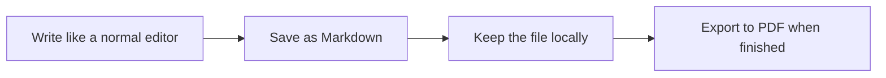
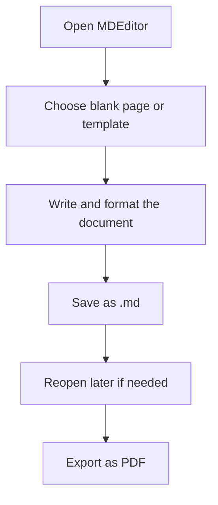

# MDEditor User Guide

This guide is written for people who just want to use the app, not study the codebase.

## What MDEditor Is

MDEditor is a desktop writing tool for Windows.

It lets you write documents in a visual editor, save them as Markdown files, and export them as PDFs.

You do not need to understand Markdown syntax to use the basic workflow.

## The Simple Idea

## What You Can Do

- start a blank document
- begin from a ready-made template
- format text with toolbar buttons
- save your work as a `.md` file
- open the file later and continue editing
- export the finished document as a PDF

## A Typical Document Journey

## First-Time Use

1. Open the app.
2. Decide whether to start with a blank page or a template.
3. Write the content in the editor.
4. Use the toolbar for bold text, headings, lists, tables, links, images, or diagrams.
5. Save the document.
6. Export a PDF when the document is complete.

## Templates

MDEditor includes simple starter templates for common document types:

- Blank document
- Report
- Meeting notes
- Proposal

Templates are meant to reduce the time needed to create a first draft.

## Saving Your Work

There are two main save actions:

- `Save`: save the current file
- `Save As`: save a copy with a new file name or location

If you try to replace unsaved content, the app asks for confirmation first.

## Exporting To PDF

When your document is ready:

1. save the current document
2. choose PDF export
3. wait for the app to convert the file

The app uses Pandoc behind the scenes to turn the Markdown file into a PDF.

## What “Offline-First” Means Here

MDEditor is designed so that your main document work happens on your computer.

That means:

- your files are local
- the editor does not depend on a cloud service for normal use
- you can keep your own folder structure

## What To Expect

MDEditor is best for:

- draft writing
- structured reports
- internal meeting notes
- proposals and administrative documents

It is not meant to replace:

- large collaborative document platforms
- advanced design/layout tools
- real-time cloud co-editing tools

## If Something Feels Unsafe

If the app warns you that there are unsaved changes, stop and decide before continuing.

That warning exists to prevent accidental loss of work.

## If You Want The Source Build

If someone on your team needs to build the app from source, the main instructions are in [README.md](../README.md).
