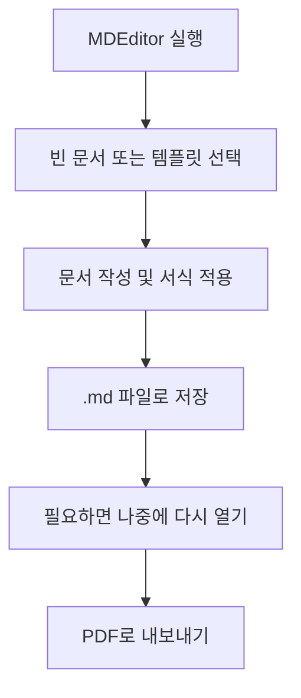

# MDEditor 사용자 안내서

이 문서는 코드를 보는 사람이 아니라, 앱을 실제로 사용하는 사람을 위한 안내서입니다.

## MDEditor란?

MDEditor는 Windows용 문서 작성 프로그램입니다.

일반 문서 편집기처럼 화면을 보며 글을 쓸 수 있고, 결과는 Markdown 파일로 저장되며, 필요할 때 PDF로 내보낼 수 있습니다.

기본 사용 흐름에서는 Markdown 문법을 몰라도 괜찮습니다.

## 아주 간단히 보면

## 무엇을 할 수 있나

- 빈 문서로 시작하기
- 준비된 템플릿으로 시작하기
- 버튼으로 글자 꾸미기
- `.md` 파일로 저장하기
- 나중에 다시 열어서 수정하기
- 완성본을 PDF로 내보내기

## 문서 작업 흐름

## 처음 사용할 때

1. 앱을 실행합니다.
2. 빈 문서로 시작할지, 템플릿으로 시작할지 고릅니다.
3. 편집 화면에서 문서를 작성합니다.
4. 툴바 버튼으로 굵게, 제목, 목록, 표, 링크, 이미지, 다이어그램 등을 넣습니다.
5. 문서를 저장합니다.
6. 문서가 완성되면 PDF로 내보냅니다.

## 템플릿

MDEditor에는 자주 쓰는 문서를 빨리 시작할 수 있도록 기본 서식이 들어 있습니다.

- 빈 문서
- 보고서
- 회의록
- 기안서

공문서 작성용 공식 템플릿도 함께 들어 있습니다.

- 기안문 (내부결재)
- 기안문 (대외시행문)
- 업무협조전
- 회의록 (행정공식)
- 검토보고서
- 민원 회신문
- 공고문

템플릿은 첫 초안을 빠르게 만들기 위한 시작점입니다.
더 자세한 설명은 [templates/README.md](../templates/README.md)를 참고하면 됩니다.

## 저장 방법

주요 저장 방식은 두 가지입니다.

- `저장`: 현재 파일에 그대로 저장
- `다른 이름으로 저장`: 새 이름이나 새 위치에 별도로 저장

아직 저장하지 않은 내용이 있는데 다른 작업으로 바꾸려 하면, 앱이 먼저 확인 메시지를 보여줍니다.

## PDF 내보내기

문서가 준비되면 아래 순서로 진행하면 됩니다.

1. 현재 문서를 저장합니다.
2. PDF 내보내기를 선택합니다.
3. 앱이 문서를 변환할 때까지 잠시 기다립니다.

이 과정에서 앱은 내부적으로 Pandoc를 사용해 Markdown 파일을 PDF로 바꿉니다.

## 오프라인 중심이라는 뜻

MDEditor는 기본적으로 내 컴퓨터 안에서 문서를 다루는 흐름을 중심으로 설계됐습니다.

즉,

- 파일은 내 컴퓨터에 저장되고
- 일반 사용에 클라우드 연결이 꼭 필요하지 않으며
- 내가 원하는 폴더 구조로 관리할 수 있습니다

## 어떤 문서에 잘 맞나

MDEditor는 아래와 같은 문서에 특히 잘 맞습니다.

- 초안 문서
- 보고서
- 회의 정리 문서
- 내부 제안서나 기안서

반대로 아래와 같은 용도는 이 앱의 주된 목표가 아닙니다.

- 여러 사람이 동시에 편집하는 문서
- 복잡한 출판용 레이아웃 작업
- 대규모 클라우드 협업 문서 플랫폼

## 주의해야 할 점

앱이 저장되지 않은 변경 사항이 있다고 알려주면, 바로 넘기지 말고 한 번 더 확인하는 것이 좋습니다.

이 경고는 작성 중인 내용을 실수로 잃어버리지 않도록 막아주는 장치입니다.

## 설치 파일이 필요하다면

설치 파일은 저장소 파일 목록이 아니라 `Releases`에 올라갑니다.

- 릴리스 페이지: [최신 릴리스 페이지](https://github.com/sinmb79/MD-Editer/releases/latest)
- 현재 기준 최신 태그: `v0.1.6`
- 설치 파일은 위 릴리스 페이지의 `Assets`에서 내려받으면 됩니다.

## 소스에서 직접 빌드하려면

팀 내 개발자가 소스에서 직접 빌드해야 한다면, 자세한 내용은 [README.md](../README.md)를 참고하면 됩니다.
